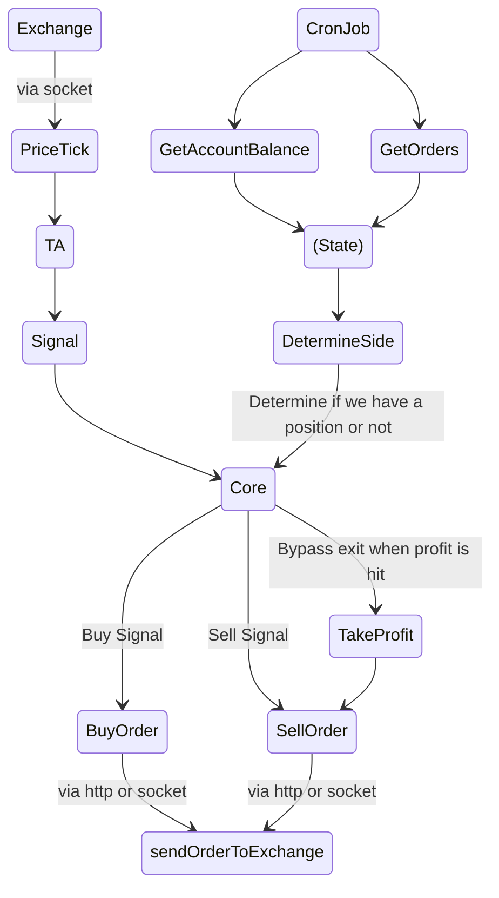

# HFT Diagrams

High level overview of HFT system

```mermaid
stateDiagram-v2
    CronJob --> GetAccountBalance
    GetAccountBalance --> (State)
    
    CronJob --> GetOrders
    GetOrders --> (State) 
    
    Exchange --> PriceTick: via socket
    PriceTick --> TA
    TA --> Signal
    Signal --> Core
    (State) --> DetermineSide
    
    DetermineSide --> Core: Determine if we have a position or not

    Core --> BuyOrder: Buy Signal
    BuyOrder --> sendOrderToExchange: via http or socket
    
    Core --> SellOrder: Sell Signal
    SellOrder --> sendOrderToExchange: via http or socket
    
    Core --> TakeProfit: Bypass exit when profit is hit
    TakeProfit --> SellOrder
```
