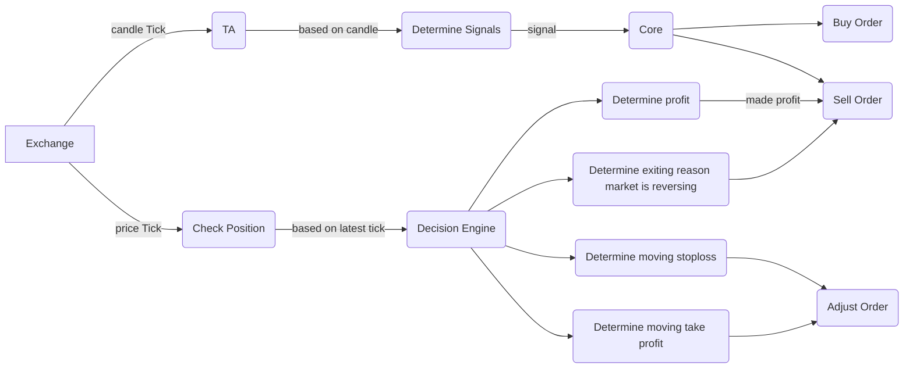

# HFT 2

With Decision Engine for more control

```mermaid
 flowchart LR
    A[Exchange] -->|candle Tick| B(TA)
    
    B -->|based on candle| C(Determine Signals)
    
    C -->|signal| D(Core)
    D --> XB(Buy Order)
    D --> XS(Sell Order)
    
    A[Exchange] -->|price Tick| BX(Check Position)
    BX -->|based on latest tick| DE(Decision  Engine)
    
    DE --> DX1(Determine profit)
    DX1 --> |made profit| XS

    DE --> DX2(Determine moving stoploss)
    DX2 --> XA(Adjust Order)

    DE --> DX3(Determine moving take profit)
    DX3 --> XA(Adjust Order)

    DE --> DX4(Determine exiting reason market is reversing)
    DX4 --> XS
```
